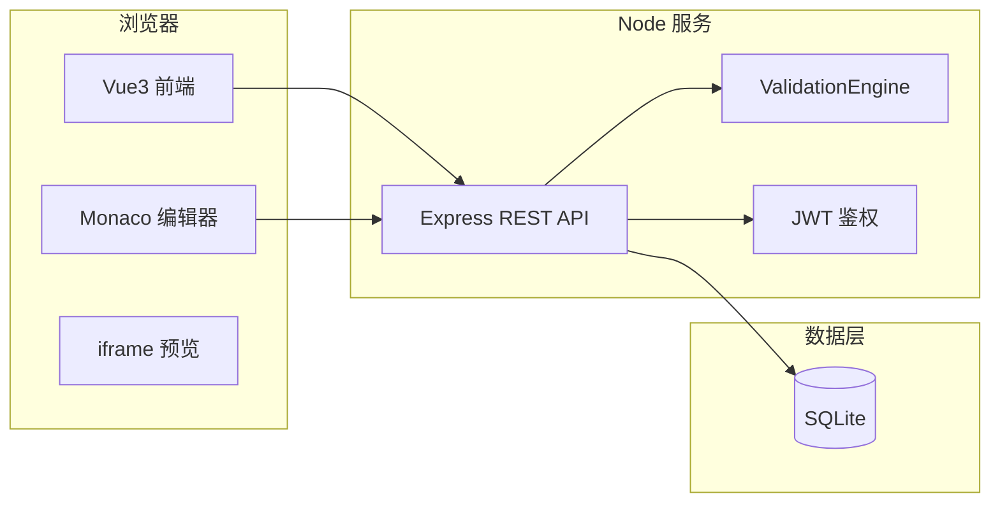

# 游戏化前端学习平台

面向前端入门的闯关式学习平台，集成在线编辑、实时预览与规则判题，支持题库管理与 Vue 专题扩展。

---

## 功能概要

- **游戏化闯关**：按章节解锁关卡，地图选关，完成任务获得经验与徽章。
- **在线编码**：内置 Monaco 编辑器，支持 HTML/CSS/JS 编辑，右侧 iframe 实时预览。
- **规则校验**：服务端校验引擎对提交代码做正则 / DOM / 自定义关卡校验。
- **用户体系**：注册登录、个人档案（EXP、等级、通关进度、当前关卡）。
- **管理员**：`admin` 角色可进入管理后台；管理用户与题库；学习侧可无解锁限制进入任意关、查看参考答案、一键填入答案。
- **题库扩展**：支持 Vue 3 等专题关卡；关卡数据由 SQLite 种子初始化，可在线编辑任务书、初始代码与校验 JSON。

---

## 系统架构

**逻辑分层**

- **客户端（`client/`）**：Vue 3 + Vite + Tailwind；地图、工作台、编辑器、预览、管理页等。
- **服务端（`server/`）**：Node.js + Express；REST API、JWT 鉴权、关卡与进度、校验引擎、SQLite 持久化。
- **数据**：SQLite（`database.sqlite`，建议勿将本地库提交到 Git）。

**架构图（Mermaid）**


---
## 操作逻辑


---

## 技术说明

| 层级 | 技术选型 |
|------|----------|
| 前端 | Vue 3、Vite、Tailwind CSS、Monaco Editor |
| 后端 | Node.js、Express |
| ORM / 数据库 | Sequelize、SQLite（sqlite3） |
| 校验 | 服务端 JSDOM + 正则 / 自定义关卡规则 |

---

## 配置说明

- **前端 API 地址**：`client` 侧可通过环境变量 `VITE_API_BASE` 指向后端（默认多为 `http://localhost:3000`）。
- **数据库**：首次运行 `start.js` 或执行数据库初始化脚本会创建表并写入关卡种子数据。
- **环境变量**：若项目使用 `.env`（如 JWT 密钥、端口），请放在项目约定目录，勿提交敏感信息。
- **管理员**：按项目约定创建或使用默认管理员账号（以 `server` 内登录/注册逻辑为准）。

---

## 运行方式

在项目根目录执行：

在项目根目录执行：

```bash
npm install
node start.js
```

`start.js` 会自动完成：

- 安装根依赖（含 `concurrently`）
- 为 `server` 安装：`express`、`sequelize`、`sqlite3`、`cors`、`jsdom`
- 为 `client` 安装：`vue`、`vite`、`@vitejs/plugin-vue`、`tailwindcss`、`postcss`、`autoprefixer`、`monaco-editor`
- 同步 SQLite 表结构并执行 SeedData（10 个 HTML/CSS/JS/DOM 关卡 + 默认用户档案）


浏览器打开：：`http://localhost:5173`

---

## 运行截图
### 普通用户
登录


做题

校验


地图


排行榜


徽章


双人协作


学习补强


---

### 管理员
管理用户


---


